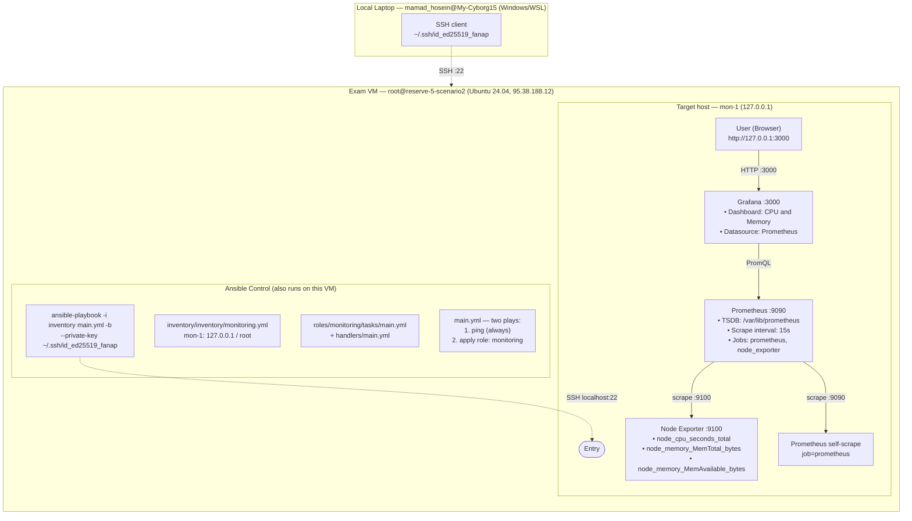

# Scenario 2

Draw the **output** system. You can use AI.
Then explain your code. 

English is better. Persian is OK.

## Architecture

Replace this picture with your real design.


The Ansible control node and the target are the same VM (loopback target). The playbook provisions Node Exporter → Prometheus → Grafana, then wires Grafana to Prometheus via provisioning files and adds a CPU & Memory dashboard. Grafana reads the provisioning files on every restart and configures itself automatically — no manual UI clicks needed.
## Code

### Playbook & Roles
main.yml contains two plays:

Check SSH connection — runs ansible.builtin.ping once across all hosts with gather_facts: false to verify SSH/key reachability before doing real work. Tagged always so it runs even when a subset of tags is selected.
Deploy monitoring stack — targets the monitoring host group, becomes root (become: true) and applies a single role: monitoring (tagged prometheus).
roles/monitoring/tasks/main.yml — the heart of the scenario. It contains, in order:

Section
What it does
Prerequisites	apt install wget curl tar gnupg adduser apt-transport-https software-properties-common
Node Exporter	Create nodeexp system user → get_url v1.7.0 tarball from github.com → unarchive → copy binary to /usr/local/bin/node_exporter → write /etc/systemd/system/node_exporter.service with --web.listen-address=0.0.0.0:9100 → daemon_reload + enabled: true + state: started. Every change notifies restart node_exporter.
Prometheus	Create prometheus user → make /etc/prometheus + /var/lib/prometheus → get_url v2.48.0 → install prometheus and promtool binaries + consoles + console_libraries → write /etc/prometheus/prometheus.yml with two scrape jobs (prometheus and node_exporter, both at localhost) → systemd unit with --web.listen-address=0.0.0.0:9090 → enable + start. Notify: restart prometheus.
Grafana	apt_key add Grafana GPG key → apt_repository add https://apt.grafana.com stable main → apt install grafana → create provisioning directories (datasources, dashboards, /var/lib/grafana/dashboards).
Datasource	Write /etc/grafana/provisioning/datasources/prometheus.yml — declares Prometheus as the default datasource, type: prometheus, uid: prometheus, url: http://localhost:9090. Notify: restart grafana.
Dashboard provider	Write /etc/grafana/provisioning/dashboards/dashboards.yml — tells Grafana to scan /var/lib/grafana/dashboards/*.json every 30 s.
CPU & Memory dashboard	Write /var/lib/grafana/dashboards/cpu-memory.json. Two panels:
• CPU Usage (%) — 100 - (avg by (instance) (rate(node_cpu_seconds_total{job="node_exporter",mode="idle"}[5m])) * 100)
• Memory Usage — node_memory_MemTotal_bytes - node_memory_MemAvailable_bytes vs node_memory_MemTotal_bytes
The JSON body is wrapped in  …  so Ansible does not try to template Grafana's {{instance}} legend placeholder (see Challenges).
Enable + wait	Enable + start grafana-server, then poll http://localhost:3000/api/health with retries: 30, delay: 2 until it returns 200 (Grafana takes ~30 s on first boot).

roles/monitoring/handlers/main.yml — three service restart handlers:
```
- name: restart node_exporter
  ansible.builtin.systemd:
    name: node_exporter
    state: restarted

- name: restart prometheus
  ansible.builtin.systemd:
    name: prometheus
    state: restarted

- name: restart grafana
  ansible.builtin.systemd:
    name: grafana-server
    state: restarted
```
Handlers fire at the end of the play (Ansible default) — that's why Grafana is restarted only after every config file is on disk, then picks up the new datasource + dashboard via provisioning.
### Inventory
The brief explicitly requires that the inventory/ folder structure is not changed — only the contents of inventory/inventory/monitoring.yml are filled in with the target's ansible_user and ansible_host. Final contents:
```
---
monitoring:
  hosts:
    mon-1:
      ansible_host: 127.0.0.1
      ansible_user: root
```
Notes:

The private key is not stored in the inventory. The brief mandates passing it on the command line via --private-key ~/.ssh/id_ed25519_fanap, so the key file lives in ~/.ssh/ of the control node and is supplied at run time.
Since I am already root on the exam VM and the target is the VM itself, ansible_host: 127.0.0.1 and ansible_user: root are the correct values. For Option 2 (Vagrant) one would set 192.168.56.10 / vagrant here instead.
## Credentials / Login
Add any login or credential data here. For example
```
# SSH to the exam VM (control node == target)
host: 95.38.188.12
user: root
key : ~/.ssh/id_ed25519_fanap   (ed25519, generated on first run, pub appended to ~/.ssh/authorized_keys)

# Grafana Web UI
url : http://127.0.0.1:3000  (or http://95.38.188.12:3000 from outside)
user: admin
pass: admin   (default — not changed)

# Prometheus
url : http://127.0.0.1:9090
auth: none

# Node Exporter
url : http://127.0.0.1:9100/metrics
auth: none
```

# Challenges

Write one item for each challenge. What broke, and how you fixed it.
For example: 
python command not found: the Ubuntu 24.04 image ships only python3. First python -m venv .venv failed. Fixed by using python3 everywhere and apt install python3.12-venv to enable venv support.
No internet access to pypi.org: pip install -r requirements.txt timed out against pypi.org (ReadTimeoutError, 15 s × 5 retries). It is a network policy on the exam VM, not a pin issue. Fixed by skipping pip and using apt install ansible-core (Ubuntu's mirror is reachable). Final version: ansible [core 2.16.3].
python3-ansible package missing: the suggested apt install -y ansible python3-ansible ... failed with E: Unable to locate package python3-ansible. The package is just called ansible-core on Ubuntu 24.04. Used apt install ansible-core instead.
Stale bash hash for pip: after switching directories, bash still pointed pip at /root/.venv/bin/pip (deleted venv). The shell was activating a venv that no longer existed. Fixed with deactivate, hash -r, and recreating the venv inside ~/exam.
'instance' is undefined: the dashboard JSON contains "legendFormat": "{{instance}}". Grafana uses that {{ }} for label interpolation, but Ansible's Jinja2 templating engine parsed it first and tried to evaluate a variable named instance. The Provision CPU & Memory dashboard task failed (failed=1, ok=24). Fixed by wrapping only the dashboard JSON body in  …  blocks (lines 252 and 295 of roles/monitoring/tasks/main.yml). After the patch the playbook completed cleanly: ok=26 changed=3 unreachable=0 failed=0 skipped=2.
id_ed25519_fanap key did not exist on the VM: the brief mandates --private-key ~/.ssh/id_ed25519_fanap, but the file was missing on the fresh VM. Generated it with ssh-keygen -t ed25519 -f ~/.ssh/id_ed25519_fanap -N "" and appended its .pub to ~/.ssh/authorized_keys so Ansible (running as root against 127.0.0.1) could authenticate non-interactively.
GitHub push rejected: git push origin scenario-2 failed with password authentication is not supported for Git operations. GitHub requires a Personal Access Token or SSH key instead of the account password. The fix commit (cc8041d) was therefore kept locally; the patched file is on the VM and the playbook runs reproducibly from the working tree. (To push: create a PAT at https://github.com/settings/tokens, then git remote set-url origin https://<TOKEN>@github.com/mh-mehdikhani2003/exam-template.git and git push.)
# Verification:
```

root@reserve-5-scenario2:~/exam# systemctl is-active node_exporter prometheus grafana-server
active
active
active
root@reserve-5-scenario2:~/exam# curl -s http://127.0.0.1:9090/-/healthy
Prometheus Server is Healthy.
root@reserve-5-scenario2:~/exam# curl -s http://127.0.0.1:9100/metrics | head -3
# HELP go_gc_duration_seconds A summary of the pause duration of garbage collection cycles.
# TYPE go_gc_duration_seconds summary
go_gc_duration_seconds{quantile="0"} 5.761e-05
root@reserve-5-scenario2:~/exam# curl -s http://127.0.0.1:3000/api/health
{
  "database": "ok",
  "version": "13.2.1",
  "commit": "56cd3e9288d8255fecebe5d05b48d191f50674b5"
}root@reserve-5-scenario2:~/exam#ls -l /var/lib/grafana/dashboards/cpu-memory.jsonn
-rw-r--r-- 1 grafana grafana 1141 Sep 12 14:20 /var/lib/grafana/dashboards/cpu-memory.json
root@reserve-5-scenario2:~/exam# curl -s -u admin:admin http://127.0.0.1:3000/api/datasources | python3 -m json.tool
[
    {
        "id": 1,
        "uid": "prometheus",
        "orgId": 1,
        "name": "Prometheus",
        "type": "prometheus",
        "typeName": "Prometheus",
        "typeLogoUrl": "public/plugins/prometheus/img/prometheus_logo.svg",
        "access": "proxy",
        "url": "http://localhost:9090",
        "user": "",
        "database": "",
        "basicAuth": false,
        "isDefault": true,
        "jsonData": {},
        "readOnly": false
    }
]
root@reserve-5-scenario2:~/exam# cd ~/exam
root@reserve-5-scenario2:~/exam# git add -A
root@reserve-5-scenario2:~/exam# curl -s -u admin:admin http://127.0.0.1:3000/api/dashboards/uid/cpu-memory | python3 -m json.tool | head -20
{
    "meta": {
        "type": "db",
        "canSave": true,
        "canEdit": true,
        "canAdmin": true,
        "canStar": true,
        "canDelete": true,
        "slug": "cpu-and-memory",
        "url": "/d/cpu-memory/cpu-and-memory",
        "expires": "0001-01-01T00:00:00Z",
        "created": "2026-09-12T14:21:01Z",
        "updated": "2026-09-12T14:21:01Z",
        "updatedBy": "Anonymous",
        "createdBy": "Anonymous",
        "version": 1,
        "hasAcl": false,
        "isFolder": false,
        "apiVersion": "v0alpha1",
        "folderId": 0,
root@reserve-5-scenario2:~/exam# curl -s -u admin:admin http://127.0.0.1:3000/api/prometheus/targets | python3 -m json.tool | head -20
{
    "message": "Not found"
}
root@reserve-5-scenario2:~/exam# git diff roles/monitoring/tasks/main.yml | head -30
root@reserve-5-scenario2:~/exam# git add roles/monitoring/tasks/main.yml
root@reserve-5-scenario2:~/exam# git -c user.email=mhms2003bzm@gmail.com -c user.name="mh-mehdikhani2003" \
    commit -m "Wrap dashboard JSON in  to prevent Ansible templating {{instance}}"
[scenario-2 cc8041d] Wrap dashboard JSON in  to prevent Ansible templating {{instance}}
 1 file changed, 2 insertions(+)
root@reserve-5-scenario2:~/exam# git push origin scenario-2
Username for 'https://github.com': mh-mehdikhani2003
Password for 'https://mh-mehdikhani2003@github.com':
remote: Invalid username or token. Password authentication is not supported for Git operations.
fatal: Authentication failed for 'https://github.com/mh-mehdikhani2003/exam-template.git/'
```
